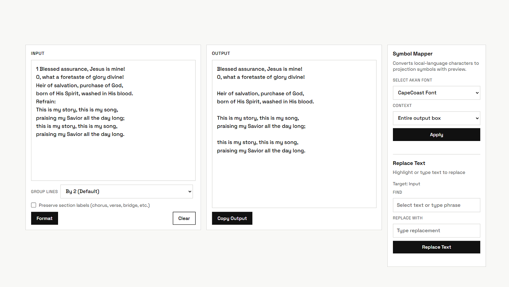
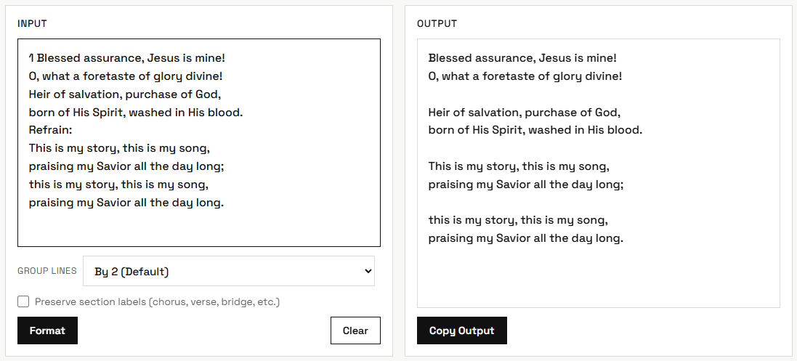
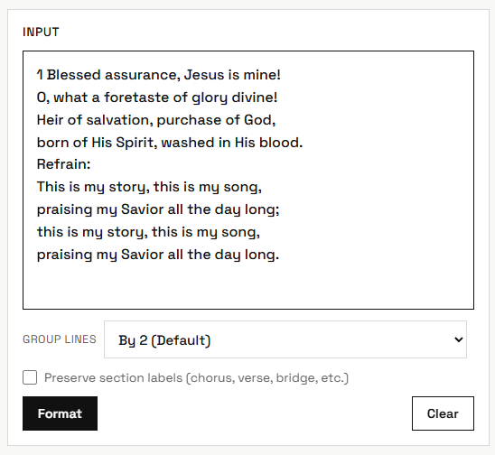
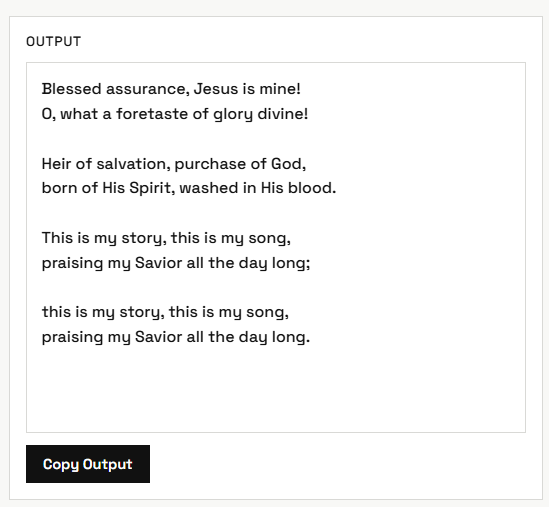
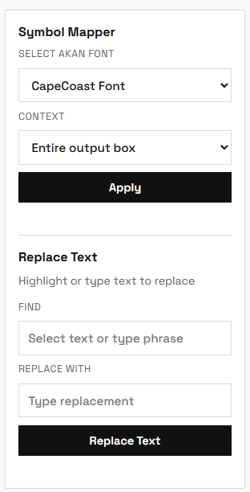

# Lyrics Formatter

Lyrics Formatter is a lightweight browser tool for cleaning and restructuring song lyrics for projection and live use.

It helps media teams quickly turn messy copied text into consistent, readable lyric blocks.

## Why this project

Preparing lyrics manually before services or events is repetitive and error-prone. This app reduces that friction by automating formatting steps while keeping the workflow simple and fast.

## Features

- Group lines by 2, 3, or a custom size
- Insert a blank line between grouped blocks for readability
- Preserve or remove section labels (Chorus, Verse, Bridge, etc.)
- Replace text in the active editor quickly
- Convert characters/symbols with preset mapping options
- Copy formatted output instantly
- Keep work in progress with session persistence

## Tech stack

- HTML
- CSS
- Vanilla JavaScript

No framework or build step required.

## Quick start

1. Clone the repository.
2. Open `index.html` in your browser.
3. Paste your lyrics into the input area.
4. Choose grouping and formatting options.
5. Copy the formatted output.

## Screenshots

### Full app view

### Input and output panels

### Input panel

### Output panel

### Extra features panel

## Project structure

- `index.html` - Main formatter interface
- `pages/why.html` - Project story and feedback section
- `assets/css/style.css` - Shared styling across pages
- `assets/js/script.js` - Formatter and tool behavior
- `assets/images/` - Visual assets
- `assets/images/screenshots/` - README preview images

## Usage workflow

1. Paste source lyrics into the input panel.
2. Select line grouping mode (`2`, `3`, or custom).
3. Toggle section-label preservation as needed.
4. Run formatting.
5. Optionally use Replace or Symbol Mapper tools.
6. Copy and paste output into your projection software.

## Contributing

Contributions are welcome.

1. Fork the repository.
2. Create a feature branch.
3. Commit focused changes with clear messages.
4. Open a pull request with a short explanation and screenshots if UI changes are included.

## License

This project is open source. See the [LICENSE](LICENSE) file for details.

## Author

Blessing Tsekpoe Eyram

GitHub: https://github.com/betsekpoe
